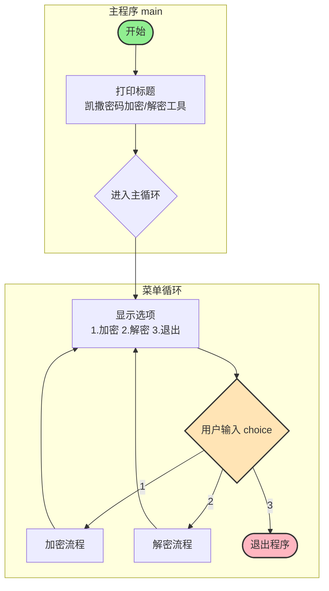
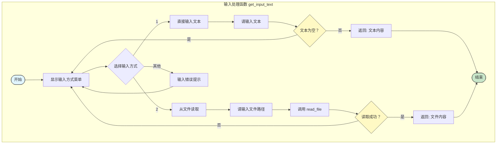

团队：wsy&wzy

团队成员：王松愉、王子逸

《凯撒密码加密/解密工具》

项目简介

    这是一个简单的凯撒密码的加密解密工具，主要用于对英文文本的加密和解密。特点包括含交互页面便于操作，方便明文与密文之间的转换。
    
功能特性

    核心功能一：可用于文本的加密，将普通文本转换为密文
    核心功能二：可用于文本的解密，将密文恢复为原文
    核心功能三：用于字母处理，可以实现大写字母（A-Z）和小写字母（a-z）的加密解密
    核心功能四：可使符号保留，对于非字母字符（空格、标点、数字等）可以保持不变
    核心功能五：能够实现循环操作，支持连续加密/解密，无需重启程序
    核心功能六：可进行输入验证，能够处理无效输入
    
快速开始

    环境要求
    
        Python 3.6 或更高版本
        无需安装第三方库
        
    运行程序
    
        将代码保存为ceasar.py
        在终端运行 python ceasar.py
        
    使用示例
        
        凯撒密码加密/解密工具

        请选择操作：
        1. 加密
        2. 解密
        3. 退出
        请输入(1-3): 1

        请选择输入方式：
        1. 直接输入文本
        2. 从TXT文件读取
        请输入(1-2): 1
        请输入文本: hello
        请输入移位值: 2

        结果：jgnnq

        请选择操作：
        1. 加密
        2. 解密
        3. 退出
        请输入(1-3): 2

        请选择输入方式：
        1. 直接输入文本
        2. 从TXT文件读取
        请输入(1-2): 1
        请输入文本: jgnnq
        请输入移位值: 2

        结果：hello

        请选择操作：
        1. 加密
        2. 解密
        3. 退出
        请输入(1-3): 1

        请选择输入方式：
        1. 直接输入文本
        2. 从TXT文件读取
        请输入(1-2): 2
        请输入文件路径: C:\Users\20888\Desktop\abc.txt
        成功读取 55 个字符
        请输入移位值: 2

        结果：cdehij
        efgjkl
        defijk
        fghklm
        efgjkl
        ghilmn
        fghklm
        hijmno

        是否将结果追加到原文件？(y/n): y
        已追加到文件末尾：C:\Users\20888\Desktop\abc.txt

        请选择操作：
        1. 加密
        2. 解密
        3. 退出
        请输入(1-3): 2

        请选择输入方式：
        1. 直接输入文本
        2. 从TXT文件读取
        请输入(1-2): 2
        请输入文件路径: C:\Users\20888\Desktop\abc.txt
        成功读取 111 个字符
        请输入移位值: 2

        结果：yzadef
        abcfgh
        zabefg
        bcdghi
        abcfgh
        cdehij
        bcdghi
        defijk
        abcfgh
        cdehij
        bcdghi
        defijk
        cdehij
        efgjkl
        defijk
        fghklm

        是否将结果追加到原文件？(y/n): y
        已追加到文件末尾：C:\Users\20888\Desktop\abc.txt

        请选择操作：
        1. 加密
        2. 解密
        3. 退出
        请输入(1-3): 3
        感谢使用，再见！

    程序运行视频
    

工作原理

    算法说明
    
        凯撒密码的解决思路在于将字母表中的字母按照固定的位移量进行移动，从而实现对英文文本的解密和加密
        加密过程：每个字母向后移动shift个位置
        解密过程：每个字母向前移动shift个位置
        核心公式：密文=（明文+shift）mod 26
        
    代码逻辑
    
        for char in text:
        # 处理大写字母
        if char.isupper():
            result += chr((ord(char) - ord('A') + shift) % 26 + ord('A'))
        # 处理小写字母
        elif char.islower():
            result += chr((ord(char) - ord('a') + shift) % 26 + ord('a'))
        # 非字母字符保持不变
        else:
            result += char
            
项目结构

    def caesar_cipher(text, shift, mode='encrypt'):
    """
    凯撒密码实现
    :param text: 要处理的文本
    :param shift: 移位数量
    :param mode: 'encrypt' 加密 或 'decrypt' 解密
    :return: 处理后的文本
    """

    def read_file(file_path):
    """读取文件内容"""

    def append_to_file(file_path, content):
    """追加内容到文件末尾"""

    def get_input_text():
    """
    获取输入文本（支持直接输入或读取文件）
    返回: 文d本内容, 是否来自文件, 文件路径
    """

    def main():
    """主程序"""

    if __name__ == "__main__":
    main()

程序整体流程图

输入处理流程图

测试用例

|输入文本|移位|操作|输出结果|
|:---:|:---:|:---:|:---:|
|Hello|2|加密|Jgnnq|
|World|3|加密|Zruog|
|!|2|加密|！|
|Python|3|加密|Sbwkrq|
|Jgnn|2|解密|Hello|
|Zruog|3|解密|World|
|Sbwkrq|3|解密|Python|

API参考

| 函数/语法 | 作用说明 | 官方文档链接 |
| :--- | :--- | :--- |
| `ord(char)` | 返回字符的 Unicode 码点（整数） | [ord()文档](https://docs.python.org/zh-cn/3/library/functions.html#ord) |
| `chr(code)` | 将整数码点转换为对应的字符 | [chr()文档](https://docs.python.org/zh-cn/3/library/functions.html#chr) |
| `str.isupper()` | 判断字符串是否全为大写字母 | [str.isupper()文档](https://docs.python.org/zh-cn/3/library/stdtypes.html#str.isupper) |
| `str.islower()` | 判断字符串是否全为小写字母 | [str.islower()文档](https://docs.python.org/zh-cn/3/library/stdtypes.html#str.islower) |
| `open()` | 打开文件，返回文件对象 | [open()文档](https://docs.python.org/zh-cn/3/library/functions.html#open) |
| `input()` | 从控制台读取用户输入 | [input()文档](https://docs.python.org/zh-cn/3/library/functions.html#input) |
| `int()` | 将字符串或数字转换为整数 | [int()文档](https://docs.python.org/zh-cn/3/library/functions.html#int) |

注意事项

    仅支持英文字母，对于数字，符号等都不能进行加密
    移位数量可以是任意整数，但必须为整数
    加密后明文的大小写仍保留
    
常见问题

    Q：是否可以处理长文本？
    A：可以处理长文本，对文本没有限制；且可以执行txt文本。

    Q：输入负数移位会发生什么？
    A：输入负数移位相当于左移动。
    

所蕴含的知识点

    1.注释
    单行注释：# 注释内容
    多行注释/对代码整体解释："""注释内容"""
    
    2.字符串
    isupper()：判断字符是否为大写字母
    islower()：判断字符是否为小写字母
    strip()：去除字符串首尾空白字符
    lower()：将字符串转换为小写
    for char in text:：遍历字符串中的每个字符
    result += char：使用 + 运算符拼接字符串
    
    3.字符处理函数
    ord() 函数：返回字符的ASCII码（如ord('A') 返回 65）
    chr() 函数：将 ASCII码转换为对应的字符（如chr(65) 返回 'A'）
    
    4.流程控制
    条件判断：if-elif-else 结构
    循环结构：while True无限循环、for循环遍历序列
    break：跳出循环
    continue：跳过本次循环
    
    5.输入输出
    输入函数input()：接收用户输入，返回字符串
    输出函数print()：打印信息到控制台
    支持格式化输出：f-string 字符串格式化
    
    6.文件操作
    打开文件
    open(file_path, 'r', encoding='utf-8')：只读模式
    open(file_path, 'a', encoding='utf-8')：追加模式
    读取文件
    read()：读取整个文件内容
    写入文件
    write()：写入内容到文件
    
    7.数据结构
    元组：函数返回多个值时，隐含使用了元组（如return text, False, None #返回一个包含三个元素的元组）
    
    8.模块化设计（去耦合）
    函数分离
    caesar_cipher()：核心加密解密逻辑
    read_file()：文件读取
    append_to_file()：文件写入
    get_input_text()：输入处理
    main()：主程序流程控制
    if __name__ == "__main__" 语句：确保模块被导入时不会自动执行主程序
    
    9.算术运算
    取模运算%：(ord(char) - ord('A') + shift) % 26

团队成员贡献

王松愉

    编写凯撒密码核心逻辑（加密/解密函数）
    搭建readme.md基础框架（标题、目录、功能介绍）
    在readme.md中编写测试用例、画流程图
    补充注意事项（如输入要求、常见问题）
    
王子逸

    编写三种模式的交互页面
    加入可读取txt文本部分并编写函数
    录制代码运行视频
    在readme.md中编写代码中出现的课堂知识点
